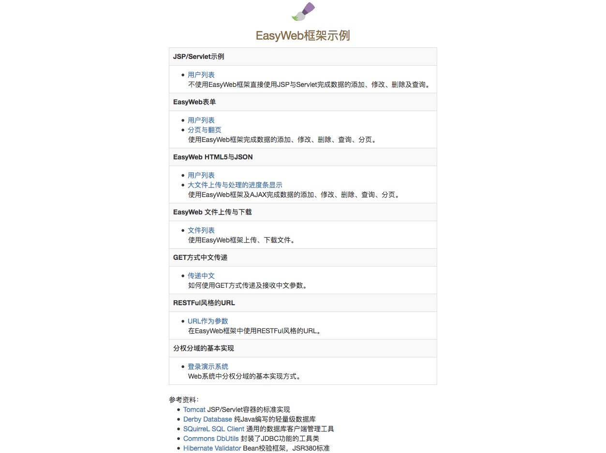

EasyWeb Framework
使用JSP/Servlet编程，表单数据到Bean的转换并验证是个繁琐无聊的过程。
EasyWeb主要完成了表单数据到Bean的转换，数据的校验采用了Hibernate Validator 6。

在jdk1.8、Tomcat 7.0上测试通过。

由于Hibernate Validator 6使用了el3.0，而Tomcat7使用的是el2.2。
所以需要使用javax.el-3.0.1-b09.jar替换Tomcat\lib下的el包，即拷贝javax.el-3.0.1-b09.jar到Tomcat7.0\lib下，
并删除其下的el-api.jar与jasper-el.jar。

Tomcat8.0以上版本不需要此操作。

